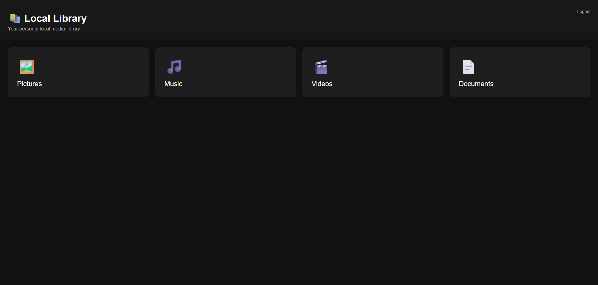

## 📸 Screenshots

### 🏠 Home


### 🔐 Login


### ❌ Error Page


# ⚙️ Setup

Follow these steps to run **Local Camp** on your computer.

## 1. Clone the Repository

```bash
git clone https://github.com/YOUR-USERNAME/Local-Camp.git
cd Local-Camp
```

## 2. Create a Virtual Environment

It is recommended to use a virtual environment for Local Camp.

### Windows

```bash
python -m venv .venv
```

Activate it:

```bash
.venv\Scripts\activate
```

## 3. Install Requirements

Install the required Python packages:

```bash
pip install -r requirements.txt
```

## 4. Start Local Camp

Run:

```bash
LocalCamp.exe
```

If everything is configured correctly, Local Camp will start on your computer.

## 5. Access Local Camp From Another Device

Make sure the other device is connected to the **same local network** as the computer running Local Camp.

Find the computer's local IP address:

```cmd
ipconfig
```

Look for the **IPv4 Address**.

For example:

```text
IPv4 Address . . . . . . : 1xx.xxx.x.xx
```

Then open this address on another device:

```text
http://1xx.xxx.x.xx
```

You can then access Local Camp from devices connected to the same LAN.

## 🔐 Security Notes

Local Camp is designed primarily for **private/local network use**.

* Keep your `.env` file private.
* Never publish your `SECRET_KEY`.
* Never publish your `APP_PASSWORD`.
* Do not expose Local Camp directly to the public internet unless you understand and properly configure the required security measures.
* This is not made for INTERNET USE.
* This is only for Local Area Network
